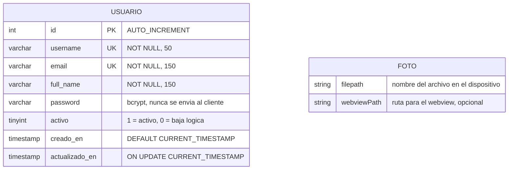
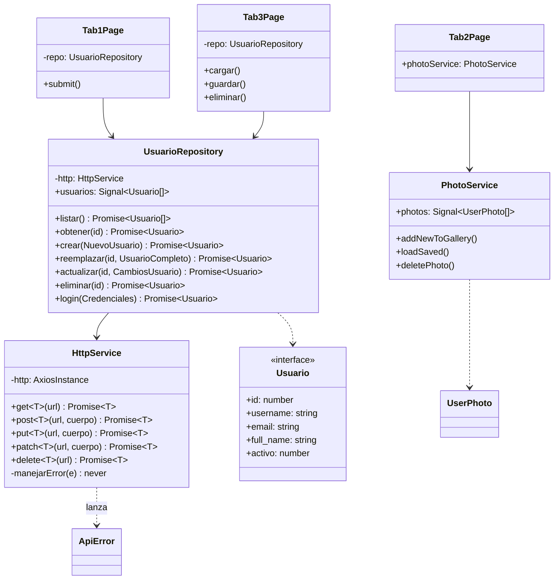

# Modelo de datos y capa de acceso a datos

**Proyecto:** APPIonic — Aplicación base del cuatrimestre
**Autor:** David Martínez Mercado
**Materia:** Programación para Móviles II
**Herramienta de IA utilizada:** Claude (Anthropic) mediante Claude Code en VS Code

---

## 1. Objetivo de la entrega

Diseñar las entidades que utiliza la aplicación e implementar una capa de acceso a
datos con servicios de Angular/Ionic.

El punto de partida fue la entrega anterior, que ya tenía login, CRUD de usuarios y
galería funcionando, pero con la capa de datos **dispersa**: no existía una carpeta de
modelos, las interfaces estaban dentro de los archivos de servicio, y un solo servicio
(`ApiService`) mezclaba el transporte HTTP con las operaciones de la entidad.

El trabajo de esta entrega fue **reorganizar** eso sin cambiar el comportamiento visible
de la aplicación ni tocar el backend en PHP.

---

## 2. Modelo de datos

La aplicación maneja **dos entidades**, y es importante señalar que **no viven en el
mismo lugar**:

| Entidad | Dónde se almacena | Persistencia |
|---|---|---|
| `Usuario` | MySQL, a través de la API en PHP | En el servidor |
| `Foto` | Dispositivo, con Capacitor Filesystem + Preferences | Local al teléfono |

### 2.1 Entidad Usuario

| Campo | Tipo | Restricciones | Descripción |
|---|---|---|---|
| `id` | `INT` | **PK**, `AUTO_INCREMENT` | Identificador único |
| `username` | `VARCHAR(50)` | `NOT NULL`, `UNIQUE` | Nombre de usuario para iniciar sesión |
| `email` | `VARCHAR(150)` | `NOT NULL`, `UNIQUE` | Correo electrónico |
| `full_name` | `VARCHAR(150)` | `NOT NULL` | Nombre completo de la persona |
| `password` | `VARCHAR(255)` | `NOT NULL` | Contraseña cifrada con bcrypt |
| `activo` | `TINYINT(1)` | `NOT NULL`, `DEFAULT 1` | 1 = habilitado, 0 = deshabilitado |
| `creado_en` | `TIMESTAMP` | `DEFAULT CURRENT_TIMESTAMP` | Fecha de alta |
| `actualizado_en` | `TIMESTAMP` | `ON UPDATE CURRENT_TIMESTAMP` | Última modificación |

Script de creación (`api/database.sql`):

```sql
CREATE TABLE usuarios (
  id         INT AUTO_INCREMENT PRIMARY KEY,
  username   VARCHAR(50)  NOT NULL UNIQUE,
  email      VARCHAR(150) NOT NULL UNIQUE,
  full_name  VARCHAR(150) NOT NULL,
  password   VARCHAR(255) NOT NULL,          -- hash bcrypt (password_hash)
  activo     TINYINT(1)   NOT NULL DEFAULT 1,
  creado_en  TIMESTAMP    NOT NULL DEFAULT CURRENT_TIMESTAMP,
  actualizado_en TIMESTAMP NOT NULL DEFAULT CURRENT_TIMESTAMP ON UPDATE CURRENT_TIMESTAMP
) ENGINE=InnoDB DEFAULT CHARSET=utf8mb4 COLLATE=utf8mb4_unicode_ci;
```

**Decisiones de diseño:**

- La contraseña nunca se guarda en texto plano: se cifra con `password_hash()` (bcrypt)
  y se valida con `password_verify()`.
- La API **nunca devuelve** el campo `password`; lo elimina del objeto antes de responder.
  Por eso la interfaz `Usuario` de TypeScript tampoco lo incluye.
- `username` y `email` son únicos. Intentar duplicarlos devuelve `409 Conflict`.
- `activo` permite dar de baja una cuenta sin borrar el registro (**baja lógica**),
  conservando el historial.

### 2.2 Entidad Foto

| Campo | Tipo | Descripción |
|---|---|---|
| `filepath` | `string` | Nombre del archivo guardado en el dispositivo |
| `webviewPath` | `string?` | Ruta que entiende el webview para pintar la imagen |

No tiene `id` numérico ni timestamps porque no es una tabla: la lista de rutas se guarda
con Capacitor Preferences y los archivos con Capacitor Filesystem.

---

## 3. Interfaces TypeScript

Se creó la carpeta `src/app/models/`, que antes no existía. Las interfaces estaban
regadas: `Usuario` dentro de `api.service.ts`, `UserPhoto` al final de `photo.service.ts`
y `FormularioUsuario` suelta dentro de `tab3.page.ts` sin exportar.

### `src/app/models/usuario.model.ts`

```typescript
export interface Usuario {
  id: number;
  username: string;
  email: string;
  full_name: string;
  /** 1 = activo, 0 = dado de baja (baja logica, el registro no se borra). */
  activo: number;
  creado_en: string;
  actualizado_en: string;
}

export type NuevoUsuario = Pick<Usuario, 'username' | 'email' | 'full_name'> & {
  password: string;
};

export type UsuarioCompleto = NuevoUsuario & { activo?: number };

export type CambiosUsuario = Partial<UsuarioCompleto>;

export interface Credenciales {
  username: string;   // el PHP acepta username o email
  password: string;
}
```

**Por qué los DTOs se derivan en lugar de escribirse a mano.**

Antes, el objeto `{ username, email, full_name, password }` aparecía escrito **tres
veces** con pequeñas variantes: en la firma de `crear()`, en la de `reemplazar()` y en el
formulario de registro. Si mañana se le agrega una columna a la entidad, hay que acordarse
de los tres lugares.

Usando `Pick` y `Partial`, los tres se derivan de `Usuario`. Agregar un campo a la entidad
lo propaga solo, y TypeScript marca de inmediato los lugares que hay que actualizar.

La distinción entre los tres tipos no es decorativa, corresponde a los verbos HTTP:

- `NuevoUsuario` → **POST**: lo mínimo para crear.
- `UsuarioCompleto` → **PUT**: reemplaza el registro, exige todos los campos.
- `CambiosUsuario` → **PATCH**: cualquier subconjunto.

### Otros archivos de modelo

- `foto.model.ts` — `UserPhoto` (se conserva el nombre original de la plantilla de Ionic
  para no romper la galería) más el alias `Foto`.
- `respuesta-api.model.ts` — `RespuestaOk<T>`, `RespuestaError` y la clase `ApiError`.
  Estas dos interfaces antes eran privadas dentro del servicio; se exportaron porque el
  servicio HTTP genérico las necesita.
- `index.ts` — *barrel* que permite escribir `import { Usuario } from '../models'`.

---

## 4. Arquitectura de la capa de acceso a datos

### 4.1 Diagrama de entidades



**Nota importante:** entre `Usuario` y `Foto` **no hay relación**. Las fotos se guardan en
el dispositivo con Capacitor y no están asociadas a ninguna cuenta: si dos personas usan
la misma app ven la misma galería. Es una limitación consciente del diseño actual, y es
la mejora natural para la siguiente entrega (agregar `usuario_id` como llave foránea y
subir las imágenes al servidor).

### 4.2 Diagrama de clases de la capa de datos



### 4.3 Separación en dos niveles

La decisión central de la entrega fue **separar el transporte de la entidad**. Antes
`ApiService` hacía las dos cosas a la vez.

**`HttpService`** — no sabe nada de usuarios. Solo manda peticiones, desenvuelve la
respuesta de la API y convierte cualquier fallo en un `ApiError`. Como todas las
respuestas del PHP vienen envueltas en `{ ok, mensaje, datos }`, este servicio extrae
`datos` una sola vez en lugar de que cada operación lo haga por su cuenta.

**`UsuarioRepository`** — es lo único del proyecto que sabe cómo se arman las URLs. Las
vistas llaman métodos con nombre (`listar`, `crear`, `eliminar`) y nunca ven una cadena
con `?accion=login` ni un verbo HTTP.

Además guarda la lista en un *signal* que se mantiene solo:

```typescript
async crear(datos: NuevoUsuario): Promise<Usuario> {
  const creado = await this.http.post<Usuario>(this.url, datos);
  this.usuarios.update((lista) => [...lista, creado]);
  return creado;
}
```

Esto es lo que justifica llamarlo *repositorio* y no un simple envoltorio: después de
crear o borrar ya no hace falta volver a pedirle la lista completa al servidor. Antes,
`tab3.page.ts` llamaba `cargar()` después de **cada** operación, lo que significaba una
petición extra cada vez.

---

## 5. Operaciones CRUD

| Operación | Método del repositorio | Verbo HTTP | Respuesta |
|---|---|---|---|
| Consultar todos | `listar()` | `GET` | 200 |
| Consultar uno | `obtener(id)` | `GET ?id=` | 200 / 404 |
| Crear | `crear(datos)` | `POST` | **201** / 409 / 422 |
| Reemplazar | `reemplazar(id, datos)` | `PUT ?id=` | 200 / 400 / 409 |
| Actualizar parcial | `actualizar(id, cambios)` | `PATCH ?id=` | 200 / 422 |
| Eliminar | `eliminar(id)` | `DELETE ?id=` | 200 / 404 |
| Autenticar | `login(credenciales)` | `POST ?accion=login` | 200 / 401 / 403 |

### Diferencia entre PUT y PATCH

Es la distinción central del diseño:

- **PUT** reemplaza el recurso completo. Exige todos los campos, incluida la contraseña.
  Si falta alguno responde 400.
- **PATCH** aplica una actualización parcial. El PHP construye la sentencia `UPDATE`
  dinámicamente con los campos recibidos y deja el resto intacto.

Del lado del cliente, `tab3.page.ts` compara el formulario contra el estado original para
enviar únicamente lo que cambió:

```typescript
private calcularCambios(): CambiosUsuario {
  const cambios: CambiosUsuario = {};
  const o = this.original;
  if (!o) return cambios;

  if (this.form.username.trim() !== o.username) cambios.username = this.form.username.trim();
  if (this.form.email.trim() !== o.email)       cambios.email    = this.form.email.trim();
  // La contrasena solo viaja si el usuario escribio una nueva
  if (this.form.password.trim())                cambios.password = this.form.password;

  return cambios;
}
```

El caso más claro es activar/desactivar una cuenta: solo viaja `{ "activo": 0 }`.

### Configuración por entorno

La URL base estaba escrita a mano dentro del servicio, con las alternativas apuntadas en
un comentario. Se movió a `src/environments/`, que ya existía y solo declaraba
`production`:

```typescript
export const environment = {
  production: false,
  apiUrl: 'http://localhost/api/usuarios.php',
  // Emulador Android:   'http://10.0.2.2/api/usuarios.php'
  // Dispositivo fisico: 'http://192.168.1.70/api/usuarios.php'
};
```

---

## 6. Cómo se utilizó la IA

Se siguió trabajando con Claude en VS Code. A diferencia de la entrega anterior —donde la
IA generaba código desde cero a partir de plantillas— aquí el trabajo fue de
**reorganización de código que ya funcionaba**, lo que cambió el tipo de errores que
aparecieron.

### Prompt 1 — Diseño de los tipos derivados

> "en vez de repetir el objeto {username, email, full_name, password} en cada método,
> derívalo de la interfaz Usuario. explícame qué utilidad de TypeScript conviene usar
> para cada caso: crear, PUT y PATCH"

**Aceptado.** La propuesta de usar `Pick` para `NuevoUsuario` y `Partial` para
`CambiosUsuario` fue correcta y resolvió la duplicación que había en tres lugares.

**Modificado.** La primera versión definía `NuevoUsuario` con `Omit<Usuario, 'id' |
'creado_en' | 'actualizado_en'>`. Funciona, pero se cambió a `Pick` porque con `Omit` hay
que ir listando lo que **no** se quiere: cada campo nuevo en la entidad se cuela
automáticamente en el DTO de creación, que es justo lo contrario de lo que conviene. Con
`Pick` se declara explícitamente lo que sí se manda.

También se corrigió que el tipo original incluía `activo` en `NuevoUsuario`. No debe
estar: al crear un usuario el PHP siempre lo pone en 1, no es algo que el cliente decida.

### Prompt 2 — Separación en HttpService y UsuarioRepository

> "separa ApiService en dos: uno genérico que solo hable HTTP y otro que sepa de la
> entidad Usuario. no rompas las pruebas que ya pasan"

**Aceptado.** La estructura de dos niveles y la idea de mover `manejarError()` tal cual al
servicio genérico, ya que estaba bien resuelto y no había razón para reescribirlo.

**Descartado.** La IA propuso convertir los métodos a `Observable` de RxJS "porque es lo
idiomático en Angular". Se rechazó por dos razones: el proyecto usa Axios con `Promise` y
*signals*, no RxJS —de hecho `rxjs` está instalado pero ningún servicio lo usaba—, y
cambiar el tipo de retorno habría obligado a reescribir las dos vistas y los 35 tests que
ya pasaban. La consigna del prompt era explícitamente no romper nada.

**Error detectado al compilar: las pruebas espiaban una clase que ya nadie usaba.**

Este fue el problema real de la entrega. La idea era conservar `api.service.ts` como
fachada para que los tests siguieran funcionando sin tocarlos. Pero al conectar las
vistas con `UsuarioRepository`, los specs quedaron espiando `ApiService` —una clase que
las páginas ya no inyectan—, así que el doble de prueba nunca se usaba.

Hubo que migrar los specs al nuevo token. El detalle que no era obvio: `UsuarioRepository`
expone `usuarios` como *signal*, y `jasmine.createSpyObj` solo crea métodos, no
propiedades. El espía se quedaba sin la lista y la vista no tenía qué pintar. Se resolvió
con el tercer argumento de `createSpyObj`, que sí permite declarar propiedades:

```typescript
const cache = signal<Usuario[]>([]);
api = jasmine.createSpyObj<UsuarioRepository>(
  'UsuarioRepository',
  ['listar', 'crear', 'reemplazar', 'actualizar', 'eliminar'],
  { usuarios: cache },       // <-- las propiedades van aqui, no con los metodos
);
api.listar.and.callFake(async () => {
  cache.set([ADMIN, ANA]);   // el espia debe rellenar la cache como el real
  return [ADMIN, ANA];
});
```

`api.service.ts` sí se conservó, marcado como `@deprecated`, porque documenta la decisión
y deja el camino de migración visible.

### Prompt 3 — Corrección del formulario de registro

> "el signup usa fullName pero la entidad usa full_name, arréglalo para que use el tipo
> del modelo directamente"

**Aceptado.** El cambio en el TypeScript fue correcto.

**Error detectado: el renombre dejó referencias rotas fuera del archivo.**

La IA cambió `tab1.page.ts` pero no revisó los demás archivos. El renombre dejó tres
referencias colgando que TypeScript **no marca como error**:

- `tab1.page.html` línea 60 — el `[(ngModel)]="signup.fullName"` seguía apuntando al
  nombre viejo. Angular no falla en compilación con esto: simplemente crea la propiedad
  en tiempo de ejecución y el campo del formulario deja de guardar nada.
- `tab1.page.spec.ts` líneas 142 y 164 — los objetos de prueba seguían con `fullName`.

Se encontraron buscando el nombre viejo en toda la carpeta (`grep -rn "fullName"`), no
leyendo el código. Es el mismo aprendizaje de la entrega pasada: el compilador no atrapa
lo que pasa dentro de las plantillas de Angular.

### Prompt 4 — Pruebas del repositorio

> "haz pruebas para el repositorio. quiero que verifiquen el verbo HTTP y la URL de cada
> operación, y que la caché de signals se actualice sin volver a llamar listar"

**Aceptado.** Las 14 pruebas resultantes, que cubren un hueco real: `ApiService` nunca
tuvo pruebas propias, así que su manejo de errores jamás se había ejercitado.

**Modificado.** La versión inicial solo comprobaba que la caché creciera al crear un
usuario. Se agregaron dos casos que importan más:

- Que al fallar una operación la caché **no** se altere (si un `DELETE` responde 404, el
  usuario no debe desaparecer de la lista en pantalla).
- Que `login()` no toque la caché, porque no es una operación del CRUD.

### Problema de entorno detectado al verificar

Al intentar correr `npm test` y `npm run build`, el CLI de Angular los rechazó:

```
Node.js version v24.13.1 detected.
The Angular CLI requires a minimum Node.js version of v22.22.3 or v24.15.0 or v26.0.0.
```

No es un problema del código sino de la versión de Node instalada, que se quedó a dos
versiones menores del mínimo que exige Angular 22. La verificación se hizo entonces
compilando directo con `tsc` sobre las dos configuraciones del proyecto:

```
npx tsc -p tsconfig.app.json  --noEmit   # exit 0
npx tsc -p tsconfig.spec.json --noEmit   # exit 0
```

Queda pendiente actualizar Node para poder ejecutar la suite completa.

### Resumen

| Decisión | Elementos |
|---|---|
| **Aceptado** | La estructura de dos niveles (transporte / entidad); mover `manejarError()` sin reescribirlo; derivar los DTOs con `Pick` y `Partial`; la caché reactiva con *signals*; las 14 pruebas del repositorio. |
| **Modificado** | `Omit` cambiado por `Pick` en `NuevoUsuario`; se quitó `activo` de ese tipo; se agregaron las pruebas de fallo que no alteran la caché; se migraron los specs a `UsuarioRepository` con el signal declarado como propiedad del espía. |
| **Descartado** | La propuesta de convertir todo a `Observable` de RxJS, por incompatible con el proyecto y porque rompía las pruebas existentes. |

### Observación sobre el uso de IA en un refactor

El tipo de error cambió respecto a la entrega anterior. Allá los fallos eran visibles al
abrir la aplicación (botones cortados, texto ilegible). Aquí la aplicación **se veía
igual** después de cada cambio, y los problemas estaban en lo que dejó de estar conectado:
pruebas que espiaban una clase en desuso, un `ngModel` apuntando a una propiedad que ya no
existía.

Ninguno de los dos lo marcó el compilador. Lo que los encontró fue buscar el nombre viejo
en todo el proyecto después de cada renombre. La conclusión es que en un refactor la IA
cambia bien el archivo que se le señala, pero no revisa lo que quedó apuntando a ese
archivo desde fuera: eso sigue siendo trabajo del programador.

---

## 7. Archivos entregados

| Requisito | Ubicación |
|---|---|
| Modelo de datos | Este documento §2 y `api/database.sql` |
| Interfaces TypeScript | `src/app/models/` |
| Servicios de acceso a datos | `src/app/services/http.service.ts`, `usuario.repository.ts`, `photo.service.ts` |
| Operaciones CRUD | `src/app/services/usuario.repository.ts`, demostradas en `src/app/tab3/` |
| Diagrama de entidades | Este documento §4 |
| Documento de uso de IA | Este documento §6 |
| Código en Git | `github.com/David-Martinez-Mercado/APPIonic` |

### Estructura resultante

```
src/app/
├── models/                      <-- nuevo
│   ├── usuario.model.ts
│   ├── foto.model.ts
│   ├── respuesta-api.model.ts
│   └── index.ts
├── services/
│   ├── http.service.ts          <-- nuevo (transporte)
│   ├── usuario.repository.ts    <-- nuevo (entidad)
│   ├── usuario.repository.spec.ts
│   ├── api.service.ts           <-- fachada @deprecated
│   └── photo.service.ts
├── tab1/   Acceso (login y registro)
├── tab2/   Galeria de fotos
└── tab3/   CRUD de usuarios
```

### Cómo verificar

Desde la carpeta `9b/`, con XAMPP corriendo (Apache y MySQL):

```bash
npm install
npm start
```

En la vista de usuarios, al editar un solo campo y guardar con PATCH, la pestaña
**Network** de las herramientas de desarrollo muestra que el cuerpo de la petición
contiene únicamente el campo modificado.
