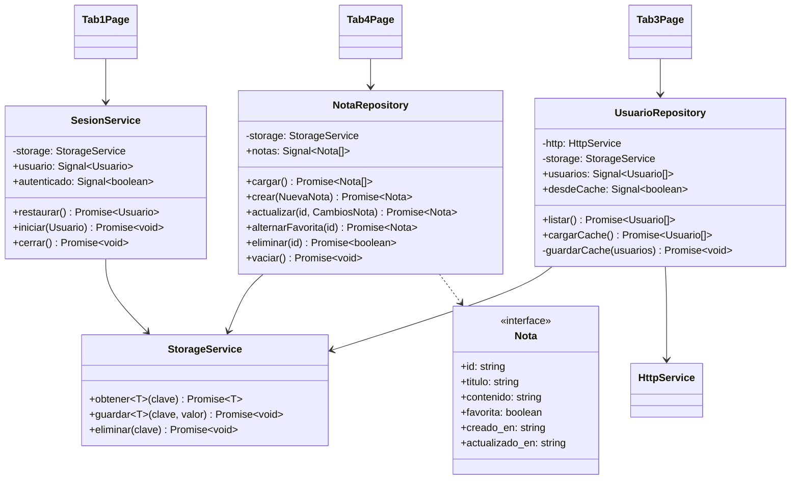

# Persistencia local de la información

**Proyecto:** APPIonic — Aplicación base del cuatrimestre
**Autor:** David Martínez Mercado
**Materia:** Programación para Móviles II
**Herramienta de IA utilizada:** Claude (Anthropic) mediante Claude Code en VS Code

---

## 1. Objetivo de la entrega

Agregar persistencia a la aplicación para que la información **no desaparezca al
cerrarla**.

El punto de partida fue la entrega anterior, que ya tenía el modelo de datos y la capa
de acceso organizada en `HttpService` + `UsuarioRepository`. El problema que quedaba era
que esa capa dependía **por completo del servidor**:

| Qué pasaba antes | Consecuencia |
|---|---|
| La sesión vivía solo en memoria | Al cerrar la app había que volver a escribir usuario y contraseña |
| La lista de usuarios se pedía siempre a la API | Con XAMPP apagado la vista quedaba en blanco |
| No existía ninguna entidad propia del dispositivo | Sin servidor, la aplicación no servía para nada |

La galería de fotos (`tab2`) era la única parte que ya persistía, porque la plantilla
oficial de Ionic ya usaba `Preferences` para guardar las rutas de las imágenes. Esta
entrega **extiende ese mismo mecanismo al resto de la aplicación**.

---

## 2. Tecnología elegida: Capacitor Preferences

De las opciones permitidas (Ionic Storage, Preferences, SQLite, almacenamiento de
archivos) se eligió **`@capacitor/preferences`**.

### Por qué

1. **Ya estaba instalada y en uso.** El proyecto la usaba en `PhotoService` desde la
   plantilla base. Agregar Ionic Storage o SQLite habría significado meter una
   dependencia nueva para resolver un problema que ya estaba resuelto.

2. **Funciona igual en las tres plataformas.** Preferences usa el almacenamiento nativo
   de cada sistema sin que el código cambie:

   | Plataforma | Dónde guarda realmente |
   |---|---|
   | Android | `SharedPreferences` |
   | iOS | `UserDefaults` |
   | Navegador (`ng serve`) | `localStorage` |

3. **El volumen de datos es pequeño.** Se guardan una sesión, una lista de usuarios y un
   conjunto de notas de texto. SQLite estaría justificado con miles de registros o
   consultas con `JOIN`; aquí sería sobreingeniería.

### Limitación consciente

Preferences guarda **texto plano**, no está cifrado. Por eso se toma una precaución
concreta, explicada en la sección 4.3: **nunca se guarda la contraseña en el
dispositivo**.

---

## 3. Qué se implementó

Se atacaron los tres huecos detectados, en tres frentes:

| # | Qué persiste | Dónde | Clave en Preferences |
|---|---|---|---|
| 1 | Sesión del usuario autenticado | `SesionService` | `sesion` |
| 2 | Caché offline de la lista de usuarios | `UsuarioRepository` | `usuarios_cache`, `usuarios_sincronizado` |
| 3 | Entidad **Nota**: CRUD 100% local | `NotaRepository` | `notas` |
| — | *(ya existía)* Galería de fotos | `PhotoService` | `photos` |

---

## 4. Arquitectura

### 4.1 Diagrama de la capa de persistencia



### 4.2 `StorageService` — la capa base

Envuelve Preferences para que nadie más repita el `JSON.parse` / `JSON.stringify`.
Cumple el mismo papel que `HttpService` hace con el servidor: **es el único que conoce el
detalle del almacenamiento**.

```typescript
async obtener<T>(clave: string): Promise<T | null> {
  const { value } = await Preferences.get({ key: clave });

  if (value === null) {
    return null;
  }

  try {
    return JSON.parse(value) as T;
  } catch {
    // Si el valor guardado quedo corrupto se descarta en lugar de tronar:
    // vale mas empezar de cero que dejar la aplicacion sin arrancar.
    await this.eliminar(clave);
    return null;
  }
}
```

El `try/catch` no es decorativo. Preferences devuelve texto, y si una versión anterior de
la app guardó un formato distinto, `JSON.parse` lanza una excepción **durante el
arranque** y la aplicación no abre. Descartar el dato corrupto es preferible.

### 4.3 Sesión persistente

`SesionService` guarda el usuario autenticado y lo restaura al abrir la app. `Tab1Page`
lo consulta en `ngOnInit`:

```typescript
async ngOnInit() {
  const guardado = await this.sesion.restaurar();

  if (guardado) {
    this.usuario.set(guardado);
    this.isActive.set(true);   // entra directo al estado autenticado
  }
}
```

**Decisión de seguridad.** Solo se persiste el objeto `Usuario` que devuelve la API, que
**nunca incluye la contraseña**: el PHP la elimina del objeto antes de responder
(`unset($fila['password'])`). En el dispositivo no queda ninguna credencial guardada, lo
cual importa porque Preferences no cifra.

Al cerrar sesión el dato se borra del dispositivo, no solo de la pantalla:

```typescript
async cerrar(): Promise<void> {
  this.usuario.set(null);
  await this.storage.eliminar(SesionService.CLAVE);
}
```

### 4.4 Caché offline del CRUD de usuarios

Los usuarios siguen viviendo en MySQL: esa sigue siendo la **fuente de verdad**. Lo que
se agregó es una copia local que se usa solo cuando el servidor no responde:

```typescript
async listar(): Promise<Usuario[]> {
  try {
    const usuarios = await this.http.get<Usuario[]>(this.url);

    this.usuarios.set(usuarios);
    this.desdeCache.set(false);
    await this.guardarCache(usuarios);
    return usuarios;
  } catch (e) {
    await this.cargarCache();   // deja los ultimos datos conocidos
    throw e;                    // pero el error sigue propagandose
  }
}
```

Dos detalles del diseño:

- **El error se vuelve a lanzar.** La vista debe seguir mostrando el mensaje de fallo; la
  caché no oculta el problema, solo evita la pantalla vacía.
- **La vista avisa.** Cuando lo mostrado salió del disco aparece un aviso ámbar con la
  fecha de la última sincronización, para que nadie confunda datos viejos con actuales.

`tab3` además carga la caché **antes** de pedirle al servidor, de modo que la lista
aparece de inmediato al abrir la app aunque la red tarde:

```typescript
async ngOnInit() {
  await this.repo.cargarCache();   // pinta lo que haya en disco
  await this.cargar();             // y luego sincroniza
}
```

### 4.5 Entidad Nota: CRUD completo sin servidor

Es la demostración más directa de la consigna: una entidad cuyo ciclo de vida completo
ocurre en el dispositivo.

| Campo | Tipo | Descripción |
|---|---|---|
| `id` | `string` | Timestamp + sufijo aleatorio, generado en el cliente |
| `titulo` | `string` | Obligatorio |
| `contenido` | `string` | Texto libre |
| `favorita` | `boolean` | Permite probar la edición parcial |
| `creado_en` | `string` | ISO 8601 |
| `actualizado_en` | `string` | ISO 8601, se refresca en cada edición |

**Por qué el `id` es `string` y no `number`:** no hay motor de base de datos que genere un
`AUTO_INCREMENT`. El id lo asigna el propio cliente combinando la marca de tiempo (que
además da el orden) con un sufijo aleatorio que evita choques si se crean dos notas en el
mismo milisegundo:

```typescript
private generarId(): string {
  return Date.now() + '-' + Math.random().toString(36).slice(2, 8);
}
```

**Toda operación escribe en disco antes de terminar.** Este es el punto que hace que la
persistencia sea real y no un caché de memoria:

```typescript
async crear(datos: NuevaNota): Promise<Nota> {
  const nota: Nota = { id: this.generarId(), ... };

  this.notas.update((lista) => [nota, ...lista]);
  await this.persistir();     // si la app se cierra aqui, el dato ya esta
  return nota;
}
```

---

## 5. Operaciones CRUD persistentes

Las cuatro operaciones que pide la entrega, en la vista **Notas** (`tab4`):

| Operación | Método del repositorio | Efecto en el dispositivo |
|---|---|---|
| **Alta** | `crear(NuevaNota)` | Agrega al arreglo y reescribe la clave `notas` |
| **Consulta** | `cargar()` | Lee la clave `notas` al entrar a la vista |
| **Modificación** | `actualizar(id, CambiosNota)` | Sustituye la nota y refresca `actualizado_en` |
| **Modificación parcial** | `alternarFavorita(id)` | Cambia un solo campo |
| **Eliminación** | `eliminar(id)` | Quita del arreglo y reescribe la clave |
| **Eliminación total** | `vaciar()` | Deja el arreglo vacío |

En la vista **Usuarios** (`tab3`) el CRUD sigue siendo contra MySQL, pero cada operación
actualiza también la copia local, de forma que la caché nunca queda desfasada respecto a
lo último que se hizo.

---

## 6. Cómo comprobar que la información persiste

Este es el procedimiento que se sigue en el video de la entrega.

### Prueba 1 — Notas (no necesita XAMPP)

1. Abrir la pestaña **Notas**.
2. Crear dos o tres notas; marcar una como favorita.
3. **Cerrar la aplicación por completo** (en el navegador, cerrar la pestaña; en el
   teléfono, cerrarla desde la lista de apps recientes).
4. Volver a abrirla y entrar a **Notas**: las notas siguen ahí, con su fecha de creación y
   la marca de favorita.
5. Editar una y eliminar otra; cerrar y reabrir: los cambios también persistieron.

### Prueba 2 — Sesión

1. En la pestaña **Acceso**, iniciar sesión con `admin` / `123456`.
2. Cerrar la aplicación por completo.
3. Volver a abrirla: entra directo a la pantalla de sesión iniciada, **sin pedir
   credenciales otra vez**.
4. Pulsar el botón de salir y reabrir: ahora sí vuelve a pedir el login, porque la sesión
   se borró del dispositivo.

### Prueba 3 — Caché offline de usuarios

1. Con XAMPP encendido, entrar a **Usuarios** para que se descargue la lista.
2. **Apagar Apache** desde el panel de XAMPP.
3. Cerrar y reabrir la aplicación, y entrar a **Usuarios**.
4. La lista sigue mostrándose, con el aviso ámbar de que son datos guardados en el
   dispositivo y la fecha de la última sincronización.

### Cómo verlo por dentro

En el navegador, con las herramientas de desarrollo abiertas:
**Application → Local Storage → `http://localhost:4200`**. Ahí aparecen las claves
`CapacitorStorage.notas`, `CapacitorStorage.sesion` y `CapacitorStorage.usuarios_cache`
con su contenido en JSON.

---

## 7. Archivos entregados

### Nuevos

```
src/app/models/nota.model.ts           Entidad Nota y sus tipos derivados
src/app/services/storage.service.ts    Envoltura de Capacitor Preferences
src/app/services/sesion.service.ts     Sesion persistente
src/app/services/nota.repository.ts    CRUD de notas contra el dispositivo
src/app/tab4/tab4.page.ts              Vista del CRUD de notas
src/app/tab4/tab4.page.html
src/app/tab4/tab4.page.scss
```

### Modificados

```
src/app/models/index.ts                Exporta el modelo Nota
src/app/services/usuario.repository.ts Cache offline de la lista
src/app/tab1/tab1.page.ts              Restaura y guarda la sesion
src/app/tab3/tab3.page.ts              Carga la cache y expone su estado
src/app/tab3/tab3.page.html            Aviso de datos sin conexion
src/app/tab3/tab3.page.scss            Estilo del aviso
src/app/tabs/tabs.routes.ts            Ruta /tabs/tab4
src/app/tabs/tabs.page.html            Boton de la pestana Notas
src/app/tabs/tabs.page.ts              Icono document-text
```

### Estructura resultante

```
src/app/
├── models/
│   ├── usuario.model.ts
│   ├── foto.model.ts
│   ├── nota.model.ts             <-- nuevo
│   ├── respuesta-api.model.ts
│   └── index.ts
├── services/
│   ├── http.service.ts             transporte HTTP
│   ├── storage.service.ts        <-- nuevo: persistencia local
│   ├── sesion.service.ts         <-- nuevo: sesion
│   ├── usuario.repository.ts       entidad + cache offline
│   ├── nota.repository.ts        <-- nuevo: entidad local
│   └── photo.service.ts            galeria (ya persistia)
├── tab1/   Acceso (sesion persistente)
├── tab2/   Galeria de fotos
├── tab3/   CRUD de usuarios (con cache offline)
└── tab4/   CRUD de notas (100% local)   <-- nuevo
```

### Cómo ejecutar

Desde la carpeta `9b/`:

```bash
npm install
npm start
```

La pestaña **Notas** funciona sin XAMPP. Para las pestañas de Acceso y Usuarios hace
falta Apache y MySQL encendidos, con `api/database.sql` importado.

---

## 8. Un error encontrado al capturar las pantallas

Tomar las capturas no fue solo trabajo de documentación: destapó un defecto real.
La sesión se guardaba bien, pero al reabrir la aplicación volvía a aparecer el
formulario de login, como si no se hubiera guardado nada.

La causa **no estaba en la capa de persistencia**. `Tab1Page` mantenía `isActive`
como una propiedad normal:

```typescript
isActive = false;            // antes
...
this.isActive = true;        // despues de un await
```

La aplicación es **zoneless**, así que Angular no vigila propiedades normales.
`restaurar()` resuelve de forma asíncrona, y para cuando el valor cambiaba Angular
ya no estaba observando: el estado era correcto en memoria pero la vista nunca se
repintaba. La solución fue convertirlo en signal, que es lo que ya usaba el resto
del componente:

```typescript
isActive = signal(false);    // despues
...
this.isActive.set(true);
```

Conviene señalar que el propio comentario del código ya advertía de esto (*"se usan
signals porque la app es zoneless"*), y aun así la regla se rompía en las dos
propiedades heredadas de la plantilla original. Un defecto de este tipo no aparece
en una compilación ni en una prueba unitaria del repositorio: **solo se ve
ejecutando la aplicación**.

---

## 9. Cómo se utilizó la IA

El detalle de los prompts, con lo que se pidió, lo que generó la IA y lo que hubo que
corregir, está en el documento **`PROMPTS-PERSISTENCIA.md`**.
