# Capturas de ejecución

Capturas tomadas con la aplicación en ejecución (`npm start`) y el backend
funcionando sobre XAMPP con Apache y MySQL activos.

## Vista 1 — Acceso (Login / Registro)

| Captura | Descripción |
|---------|-------------|
| 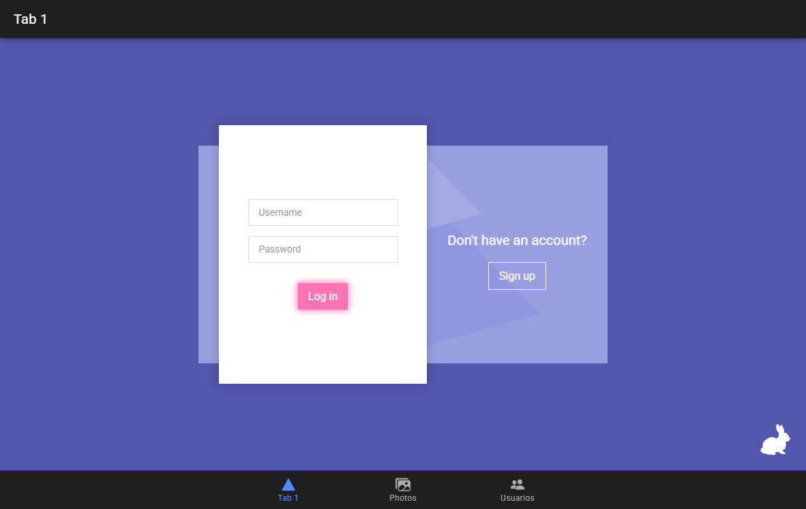 | Formulario de inicio de sesión |
| 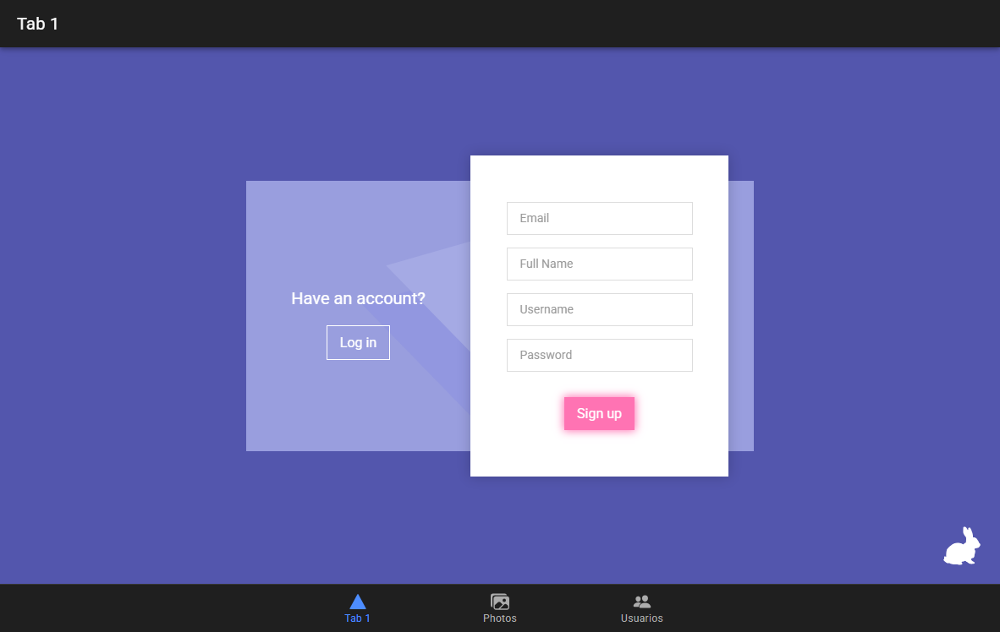 | Panel de registro tras pulsar "Sign up"; el formulario se desliza |
| 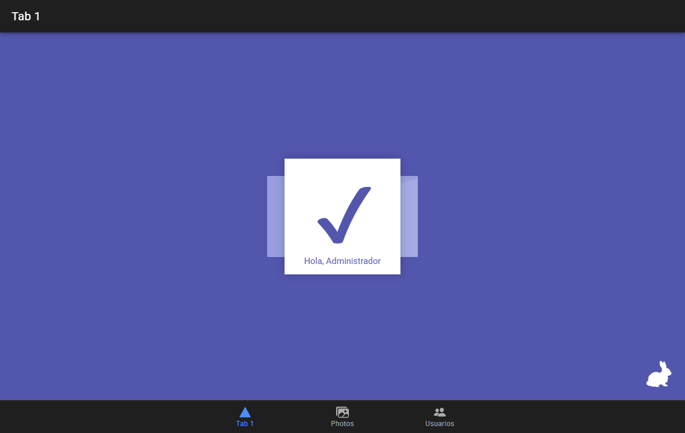 | Sesión iniciada correctamente: la tarjeta se contrae y muestra la palomita con el saludo al usuario |
|  | Contraseña incorrecta. El mensaje proviene del servidor (`401 Unauthorized`) |

## Vista 2 — Galería de fotos

| Captura | Descripción |
|---------|-------------|
| 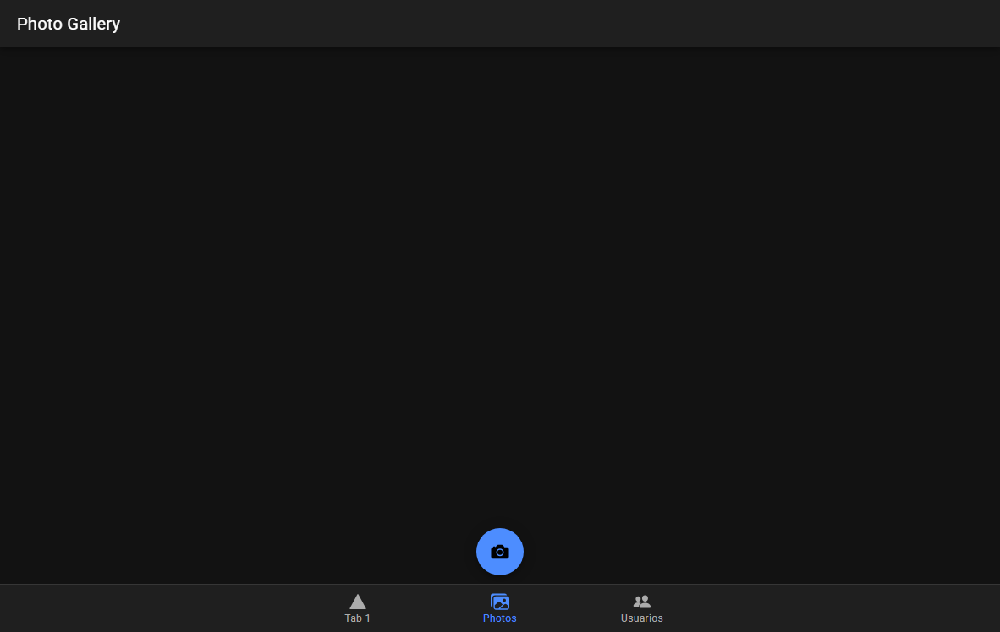 | Módulo de cámara con Capacitor |

## Vista 3 — CRUD de usuarios

| Captura | Descripción |
|---------|-------------|
| 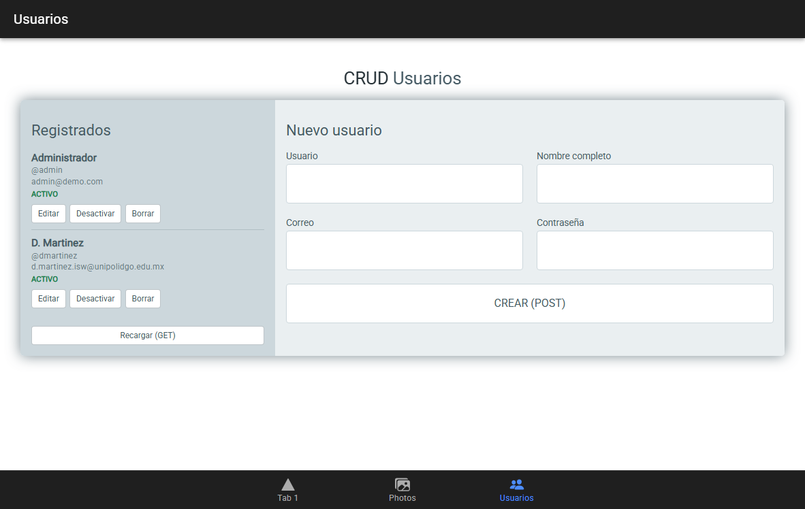 | Listado de usuarios obtenido con `GET` |
| 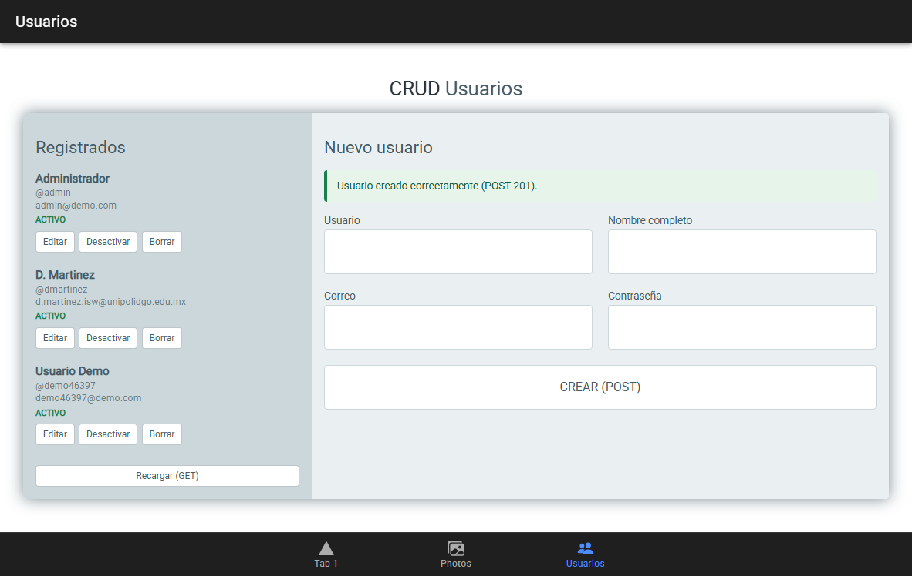 | Usuario creado con `POST` (`201 Created`) |
| 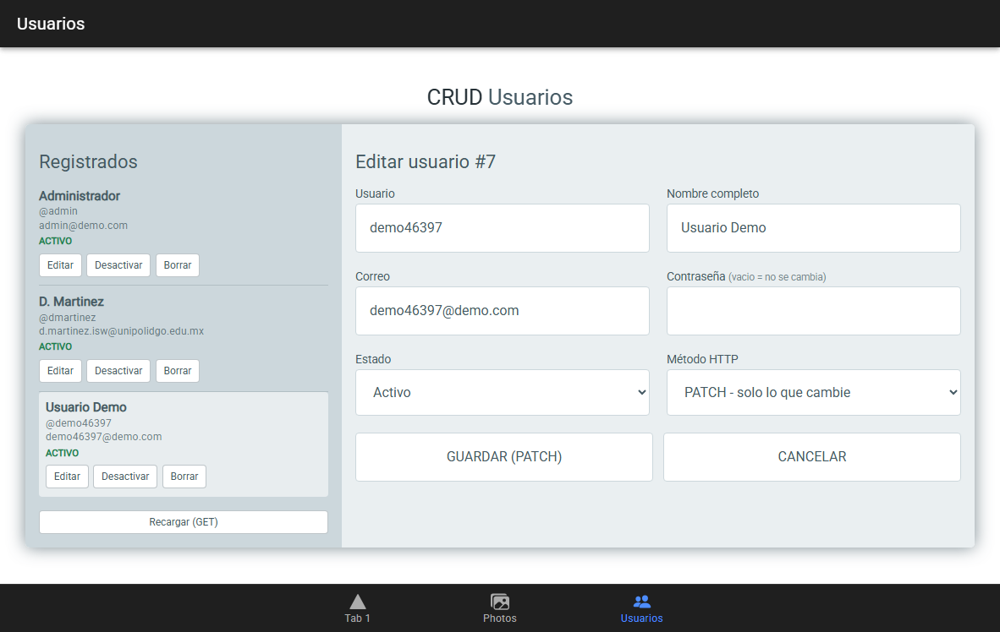 | Modo edición: se cargan los datos y aparecen los selectores de estado y método HTTP |
| 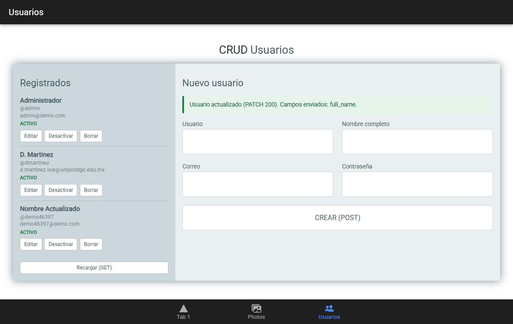 | Actualización parcial con `PATCH`. El mensaje indica qué campos se enviaron |
| 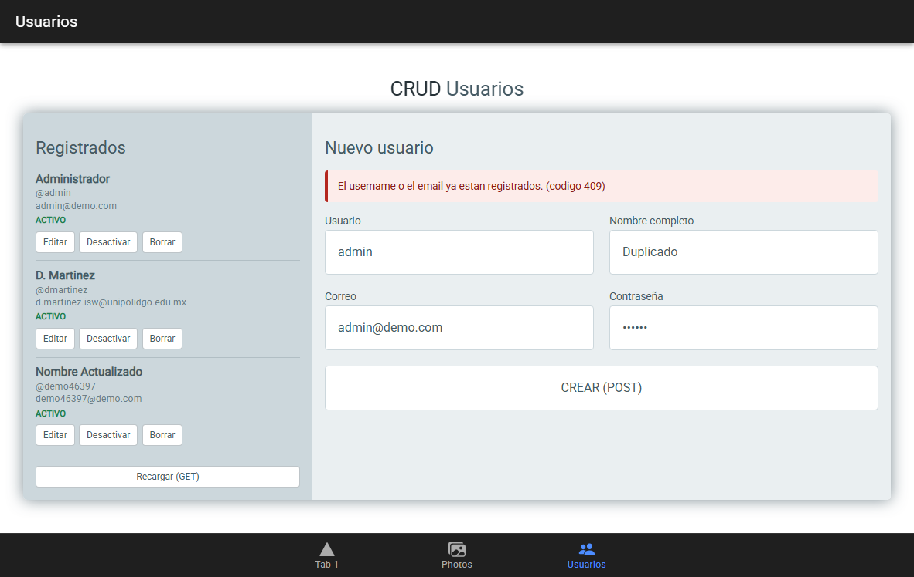 | Intento de crear un usuario duplicado (`409 Conflict`) |
| 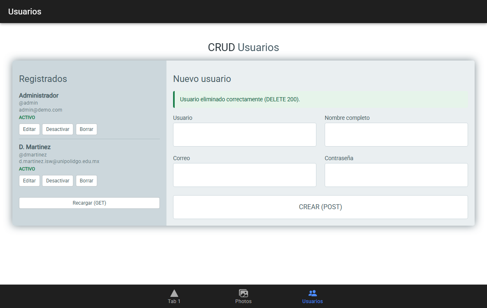 | Usuario eliminado con `DELETE` |

## Diseño responsivo

| Captura | Descripción |
|---------|-------------|
| 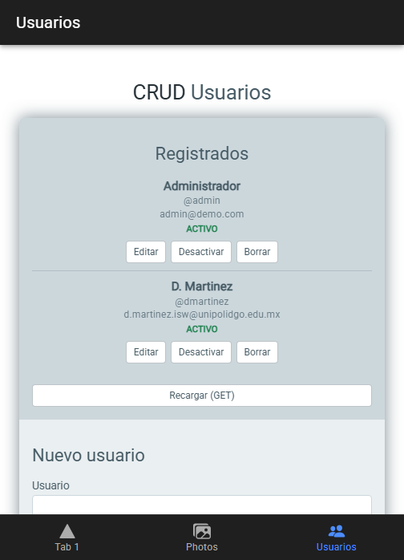 | Vista del CRUD en resolución móvil: las columnas se apilan al bajar del breakpoint de 700px |
| 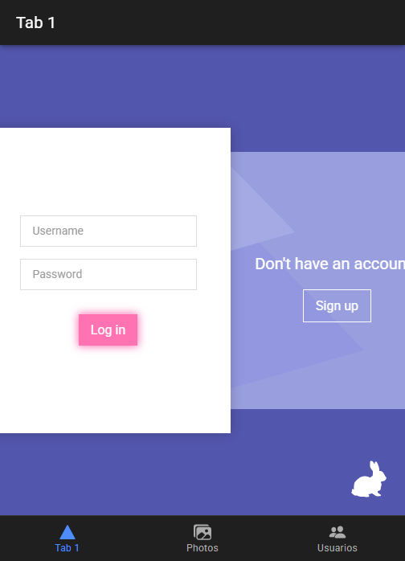 | Vista de acceso en resolución móvil |
